# Sean Collins · SMC17

> Substrate engineering in Zig — inference, quant validation, cognitive architecture,
> supply-chain integrity, physical-systems intelligence. AGPL-3.0 across the board.

sean@sunlitmoon.online · https://sunlitmoon.online

---

## Portfolio Map

```mermaid
flowchart TB
    subgraph Inference["Inference and ML"]
        VLLM[vllm-zig]
        TK[triton-kernels]
        AB[autogen_beam]
        MIL[mech_interp_liveview]
    end

    subgraph Quant["Quant Validation"]
        QVZ[quant-validation-zig]
        SX[stax-experiment]
        PFL[predmkt-forecast-log]
    end

    subgraph QRG["QRG-stack Cognitive Architecture"]
        QPE[qpe-zig]
        MFV[mac-fac-vector]
        SME[sme-zig]
        QPE --> MFV --> SME
    end

    subgraph Supply["Supply-chain Integrity"]
        SSB[sentinel-sbom]
        FSI[fleet-sbom-index]
        SOH[sovereign-offense-harness]
        SSB --> FSI
    end

    subgraph Primitives["Substrate Primitives"]
        ZH3[zig-h3]
        ZG[zig-graph]
        SZ[symbols-zig]
    end

    subgraph Physical["Physical Systems"]
        ST[steam · NYISO energy]
        CR[carreir · HVAC]
        OM[oceanman · cables]
        MAN[manifest · live entertainment]
        GR[gradient · momentum platformer]
    end

    OM --> ZH3
    OM --> ZG
    VLLM --> AB
    QVZ --> PFL
    SX --> QVZ

    click VLLM "https://github.com/SMC17/vllm-zig"
    click TK "https://github.com/SMC17/triton-kernels"
    click AB "https://github.com/SMC17/autogen_beam"
    click MIL "https://github.com/SMC17/mech_interp_liveview"
    click QVZ "https://github.com/SMC17/quant-validation-zig"
    click SX "https://github.com/SMC17/stax-experiment"
    click PFL "https://github.com/SMC17/predmkt-forecast-log"
    click QPE "https://github.com/SMC17/qpe-zig"
    click MFV "https://github.com/SMC17/mac-fac-vector"
    click SME "https://github.com/SMC17/sme-zig"
    click SSB "https://github.com/SMC17/sentinel-sbom"
    click FSI "https://github.com/SMC17/fleet-sbom-index"
    click SOH "https://github.com/SMC17/sovereign-offense-harness"
    click ZH3 "https://github.com/SMC17/zig-h3"
    click ZG "https://github.com/SMC17/zig-graph"
    click SZ "https://github.com/SMC17/symbols-zig"
    click ST "https://github.com/SMC17/steam"
    click CR "https://github.com/SMC17/carreir"
    click OM "https://github.com/SMC17/oceanman"
    click MAN "https://github.com/SMC17/manifest"
    click GR "https://github.com/SMC17/gradient"
```

## Lanes

### Inference and ML

| Repo | What it ships |
|---|---|
| [vllm-zig](https://github.com/SMC17/vllm-zig) | Pure-Zig LLM serving substrate — paged attention, BF16 kernels, persistent thread-pool dispatch. v0.0.6 toy batch-1 generator (NOT vLLM-equivalent) |
| [triton-kernels](https://github.com/SMC17/triton-kernels) | 8 autotuned Triton kernels — fused softmax, fused RMSNorm, flash-attention v2 forward + backward (fp32 + fp16); correctness + benchmark harness vs PyTorch |
| [autogen_beam](https://github.com/SMC17/autogen_beam) | BEAM/OTP multi-agent orchestration substrate; supervised GenServer agents, Registry + DynamicSupervisor, pluggable LLM `@behaviour` |
| [mech_interp_liveview](https://github.com/SMC17/mech_interp_liveview) | BEAM-native data layer + static HTML dashboard for LLM activation traces; Phoenix LiveView path is v0.0.3 work, not yet shipped |

### Quant Validation

| Repo | What it ships |
|---|---|
| [quant-validation-zig](https://github.com/SMC17/quant-validation-zig) | Bailey & López de Prado bias-defence stack — Probabilistic Sharpe Ratio, Deflated Sharpe Ratio, Purged K-Fold CV, CPCV; 30/30 tests |
| [stax-experiment](https://github.com/SMC17/stax-experiment) | Append-only pre-registration + verdict CLI; register the falsifier BEFORE testing; tracks Type-1 (overclaim) and Type-2 (missed-risk) catches on the agent's own work |
| [predmkt-forecast-log](https://github.com/SMC17/predmkt-forecast-log) | Calibrated-forecast logger for prediction-market work; JSONL schema + Brier score primitives |

### QRG-stack · Cognitive Architecture

| Repo | What it ships |
|---|---|
| [qpe-zig](https://github.com/SMC17/qpe-zig) | Qualitative Process Engine (Forbus 1984) — upstream of the QRG-stack lineage; Phase 1 process compiler integration-tested over 3 canonical scenarios |
| [mac-fac-vector](https://github.com/SMC17/mac-fac-vector) | MAC/FAC analogue retrieval (Forbus/Gentner/Law 1995) — middle layer; FNV-1a embedder + cosine top-K MAC stage integration-tested vs the sme-zig 13-analogy corpus |
| [sme-zig](https://github.com/SMC17/sme-zig) | Structure-Mapping Engine (Falkenhainer/Forbus/Gentner) — reproduces SME v4 reference on the canonical analogy corpus (12/13 set-equal, 1/13 symmetric-tie partial, 0/13 divergent) |

### Supply-chain Integrity

| Repo | What it ships |
|---|---|
| [sentinel-sbom](https://github.com/SMC17/sentinel-sbom) | Nix `flake.lock` + `build.zig.zon` → SPDX 2.3 SBOM divergence detector; single Zig binary, 93/93 tests |
| [fleet-sbom-index](https://github.com/SMC17/fleet-sbom-index) | Cross-fleet SPDX 2.3 SBOM index — divergence, drift, fleet-snapshot, layered tree, Ed25519-signed manifests; consumer of sentinel-sbom |
| [sovereign-offense-harness](https://github.com/SMC17/sovereign-offense-harness) | Adversary-emulation runner with refuse-by-default operator-error gate; signed audit envelopes; EXPERIMENTAL Atomic Red Team adapter. Authorized-use only; CFAA / CMA equivalents apply |

### Substrate Primitives

| Repo | What it ships |
|---|---|
| [zig-h3](https://github.com/SMC17/zig-h3) | H3 v4 spatial index — idiomatic Zig wrapper over all 70 public libh3 functions + 7,280-line pure-Zig port; wrapper + cross-validation + fuzz + property + resolution-sweep test surface; CI on Linux x86_64, Linux aarch64, macOS arm64 |
| [zig-graph](https://github.com/SMC17/zig-graph) | Sparse graph algorithms in pure Zig — traversal, centrality (PageRank / Brandes / closeness / eigenvector), spectral (Fiedler), community (Louvain), max-flow (Edmonds-Karp); closed-form λ₁ match to 1e-6 on canonical graphs |
| [symbols-zig](https://github.com/SMC17/symbols-zig) | Reproducible decipherment methodology — corpus loaders, entropy, n-gram LM, hillclimb substitution solver, stationary bootstrap; methodology is the artifact, findings are claims |

### Physical Systems

| Repo | What it ships |
|---|---|
| [steam](https://github.com/SMC17/steam) | NYISO energy market research engine — bronze→silver→ClickHouse→gold pipeline; scoped bronze validation, silver manifests, idempotent ClickHouse loads, typed LBMP facts, regime/outlier validation |
| [carreir](https://github.com/SMC17/carreir) | Physical-intelligence substrate for HVAC + cold-chain in Zig; 54 tests; pre-1.0 explicit tag posture |
| [oceanman](https://github.com/SMC17/oceanman) | Submarine cable knowledge base + analysis methodology — 693 cables, reproducible 7-step pipeline |
| [manifest](https://github.com/SMC17/manifest) | Live-entertainment revenue substrate — seat inventory state machines, event unit economics, sponsorship-yield, holdback-release timing, secondary-market spread detection; 147/147 tests |
| [gradient](https://github.com/SMC17/gradient) | Momentum-platformer + AI archetype substrate; Zig + raylib-zig 6.0 client; S1 movement-feel prototype |

---

## Discipline

Everything in this portfolio runs under three rules:

1. **Pre-register the falsifier before the test.** [stax-experiment](https://github.com/SMC17/stax-experiment) is the audit substrate.
2. **Pre-1.0 vocabulary until the substrate earns the words.** Zig itself is pre-1.0; no v1.x semver claim on a Zig substrate until Zig 1.0 ships. Earlier v1.x tags on these repos are preserved for changelog continuity but called out in each repo's `STATUS.md` as Type-I corrections.
3. **Honest non-claims.** Every repo ships with an explicit "what does NOT ship yet" section and a non-claims list.

## License

All public repos in the portfolio: AGPL-3.0-or-later.

## Contact

sean@sunlitmoon.online · [sunlitmoon.online](https://sunlitmoon.online)
